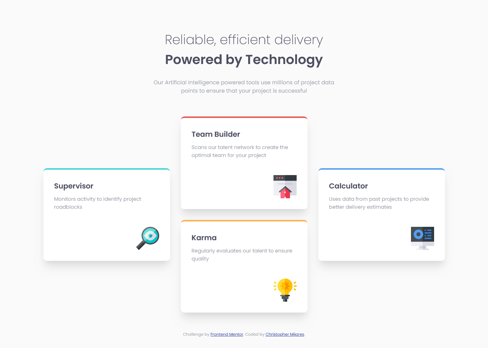

# Frontend Mentor - Four card feature section solution

This is a solution to the [Four card feature section challenge on Frontend Mentor](https://www.frontendmentor.io/challenges/four-card-feature-section-weK1eFYK). Frontend Mentor challenges help you improve your coding skills by building realistic projects. 

## Table of contents

- [Overview](#overview)
  - [The challenge](#the-challenge)
  - [Screenshot](#screenshot)
  - [Links](#links)
- [My process](#my-process)
  - [Built with](#built-with)
  - [Useful resources](#useful-resources)
- [Author](#author)

## Overview

### The challenge

Users should be able to:

- View the optimal layout for the site depending on their device's screen size

### Screenshot

### Links

- Solution URL: [https://www.frontendmentor.io/solutions/responsive-four-card-feature-solution-with-css-grid-X9JMlV1v_Y](https://www.frontendmentor.io/solutions/responsive-four-card-feature-solution-with-css-grid-X9JMlV1v_Y)
- Live Site URL: [https://my-four-card-solution.netlify.app/](https://my-four-card-solution.netlify.app/)

## My process

### Built with

- Semantic HTML5 markup
- CSS custom properties
- Flexbox
- CSS Grid
- CSS BEM
- Mobile-first workflow

### Useful resources

- [Perfect Pixel](https://www.welldonecode.com/perfectpixel/) - Just a helpful extension to get Pixel Perfect designs.
- [CSS Box-Shadow Samples](https://getcssscan.com/css-box-shadow-examples) - Just a site i use for shadows.

## Author

- Frontend Mentor - [@Cemijares23](https://www.frontendmentor.io/profile/Cemijares23)

